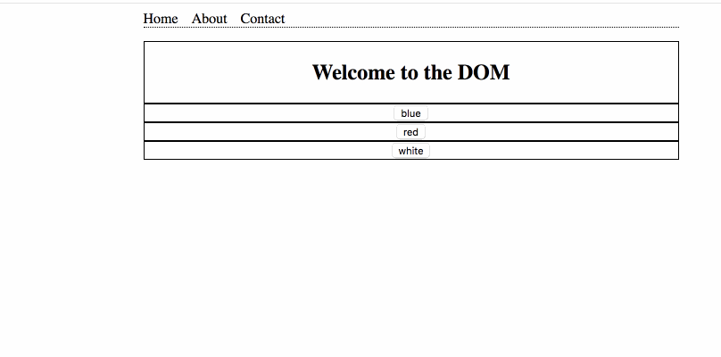

## Simple DOM Manipulation
__Time Limit:__ 30-45 minutes  
__Skill Level:__ Beginner

## Example:

## Instructions:
Create a simple webpage with the following elements:
- [ ] 5 sections
  - All elements should be centered and have the same width
  - All centered items should remain centered even the window is resized

 - [ ] The first section should be a flat navigation element with a dotted bottom border
   - It's navigation items should be an ordered list with the following list items
     - [ ] home
     - [ ] about
     - [ ] contact

 - [ ] The first div should have a centered heading that says 'Welcome to the DOM'
 - [ ] The second div section should have a button that makes the background blue
 - [ ] The third div section should have a button that makes the background red
 - [ ] The fourth section should have a button that makes the background white

## Refactor
 - What's the smallest amount of lines you can write your script in?
 - What if you only have one button on the page, can you get it to do the job of the previous three?

## Resources
- https://developer.mozilla.org/en-US/docs/Web/API/document
